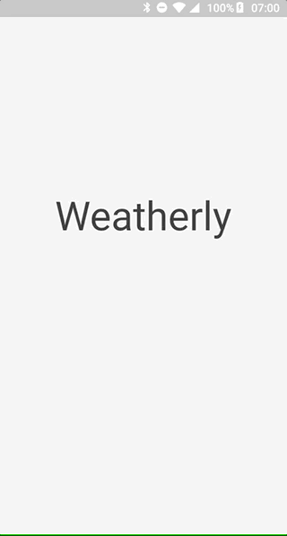
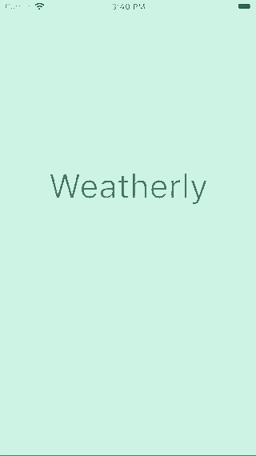

# Weatherly Flutter

Simple application for Android and iOS showing the current weather for user location. Provided with two languages (polish and english) changing dynamically with the phone's language.

## Description

Weatherly uses data from [OpenWeatherAPI](https://openweathermap.org/api).
It shows such info as:
* current temperature with weather description and cloudiness,
* humidity, pressure and wind speed,
* sunrise and sunset hours,
* graph with the hourly temperature for the following 2 days.

## Tech stack

* Flutter - no need for explanation,
* Dio - HTTP client for getting data,
* Bloc/Cubit - state management library helping seperating business logic from presentation,
* Freezed - package for easy generating unions, data classes,
* Intl - text localizations with different languages,
* Geolocator/Geocoding - packages providing easy access to platform specific location services,
* Permission Handler - handling permissions with cross-platform API,
* Flutter Platform Widgets - providing platform specific widgets,
* Mp Chart - displaying hourly weather info.

## App Demo

### Android

### iOS

